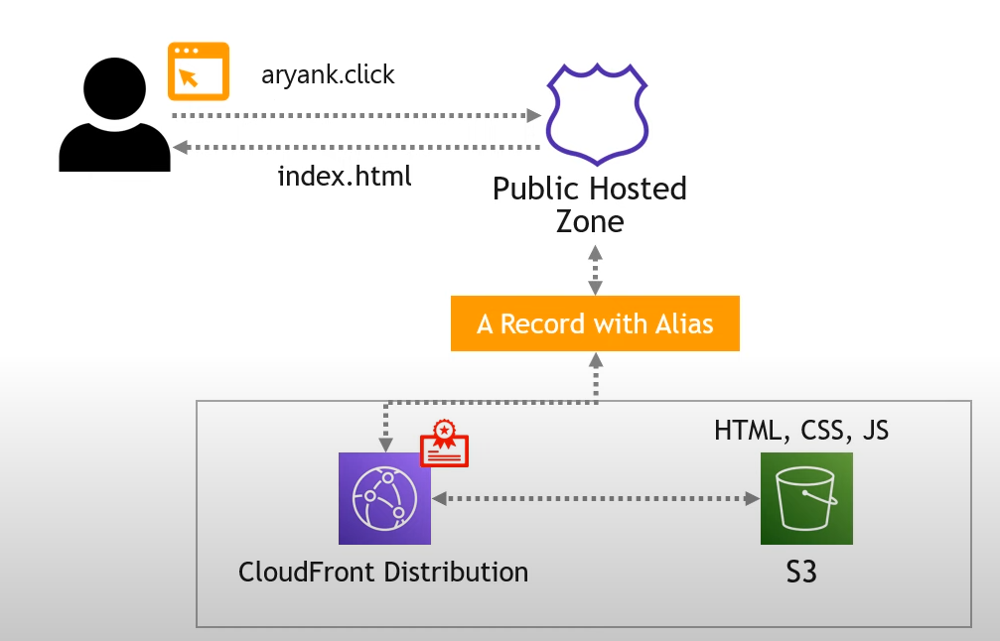
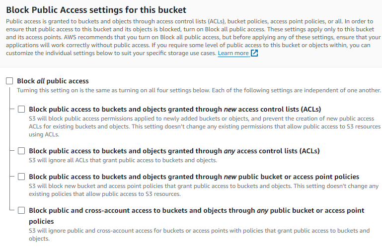
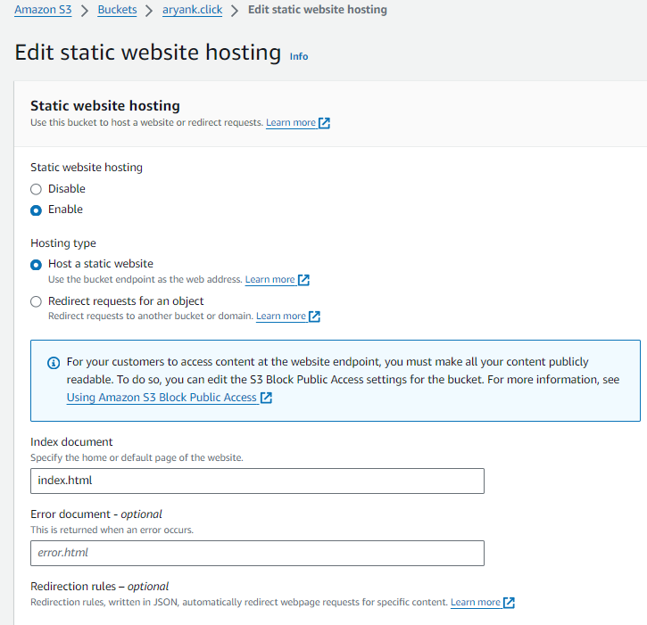
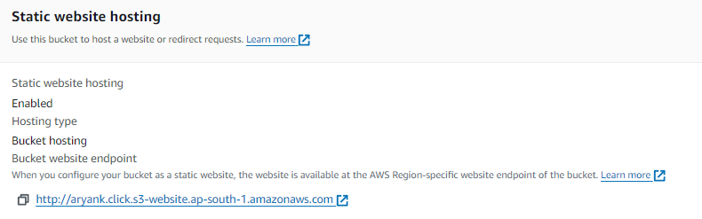
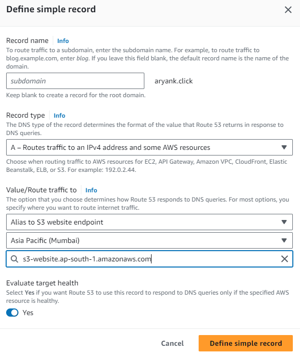
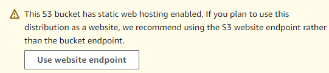
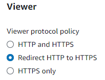
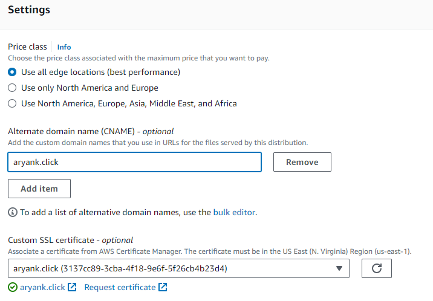

# Static Website hosting - AWS project.

### Aim :

* To host a Secured Static website in AWS enviorment.

### What you will accomplish :
* Build a Static website.
* Make it work with a custom domain name.
* Incorporate Cloudfront and SSL/HTTPS.


### Services used :
1. AWS S3
2. AWS Amplify
3. AWS Route 53
4. AWS Certificate Manager
5. AWS Cloudfront


### Architecture 



## Steps : 

### 1. Create your bucket for hosting your website.

* While creating the bucket , please note that your bucket name should match your custom domain name. In this example - aryank.click.
* For your bucket to be accessible publicly , disable Block public access.

* Go ahead and create your bucket.
* Enable Static website Hosting :
    * Open your bucket and go into Properties tab. Scroll down and click on edit for Static Website Hosting.
    * Enable Static web hosting and in Index document box enter index.html and save changes.
    
* Apply bucket policy for public access : 
    * Go into Permissions tab . Scroll down and edit bucket policy as shown below
```Json
    {
    "Version": "2012-10-17",
    "Statement": [
        {
            "Sid": "PublicReadGetObject",
            "Effect": "Allow",
            "Principal": "*",
            "Action": "s3:GetObject",
            "Resource": "arn:aws:s3:::aryank.click/*"
        }
    ]
}
```
#### Remember to update your bucket name in "Resource" key value.

* Upload your HTML,CSS,Javascript code to the bucket.
* Once uploaded you can now test your website in the Static website hosting section. A bucket website endpoint will be available.Open it to view your website.


Currently this website is served on a fully qualified domain name .We need to make it available on our own custom domain name.


### 2. Host your website on your custom domain.

* Go to AWS Route 53 . In hosted zones , open your domain and create a record. This record will redirect incoming traffic to our website in the S3 bucket.
* Click on create record . Select simple routing . Select define simple record and in endpoint section choose Alias to S3 website endpoint.
* Select your region and bucket accordingly and create the record.

* Now you can use your custom domain to open your website.

### 3. Request SSL certificate for your domain.
#### Note : Change your region to us-east-1(N.Virginia) to create your certificate. This is important as later in the steps , Cloudfront specifically requires certificates created in  us-east-1(N.Virginia) region only.
* Open Amazon Certificate manager. request a public certificate.
* Enter your fully qualified domain name.
* Leave everything on default and click on request.
* Now a request will be executed. Meanwhile open your requested certificate and in Domain section click on Create records in Route 53.This will create a CNAME record of our domain in Route 53.
 
 ### 4. Apply certificate to your domain.

 #### Note : You cannot apply SSl certificates directly to your S3 bucket. We will have to setup a Cloudfront distribution that points to our website in S3 bucket. SSl certificate will then be assigned to this distribution

 * Open AWS Cloudfront and click on Create a Cloudfront distribution.
 * Enter origin domain. A dialogue box will appear asking for whether to use S3 website endpoint rather than bucket endpoint. Click on Use website endpoint.  
 

 * In Viewer section , select Redirect HTTP to HTTPS.  
 
 * In Web Application Firewall section, select Do not enable security protections to keep it simple.
 * In Settings section, add your custom domain name as your alternate domain and select your custom SSl certificate.  
 
 * In Default root object section , enter index.html
 * Leave everything else default and then select Create distribution.

 ### 5. Redirect Route 53 to Cloudfront distribution.
 * Open Route53 and edit your A record.
 * Change route traffic : Alias to CloudFront distribution and select your distribution. Click save.

### Test your website
 Go to your domain. your website will be hosting securely.

## Congratulations!
### You have successfully hosted a Secured Static website.